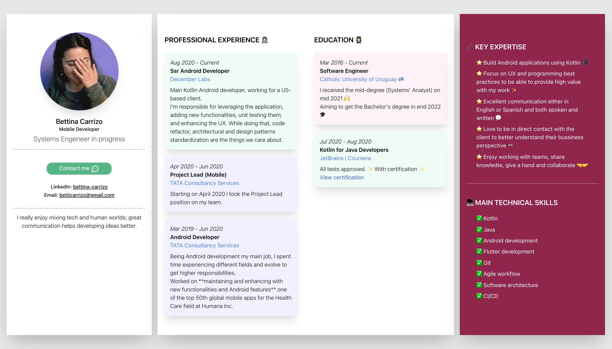

## Howdy!
This is my Curriculum Vitae made in Svelte :) 
Unfortunately it's not working with Github Pages still (but will be in future time), so by now here's a preview of how it looks like. 

Hope you like it :)

